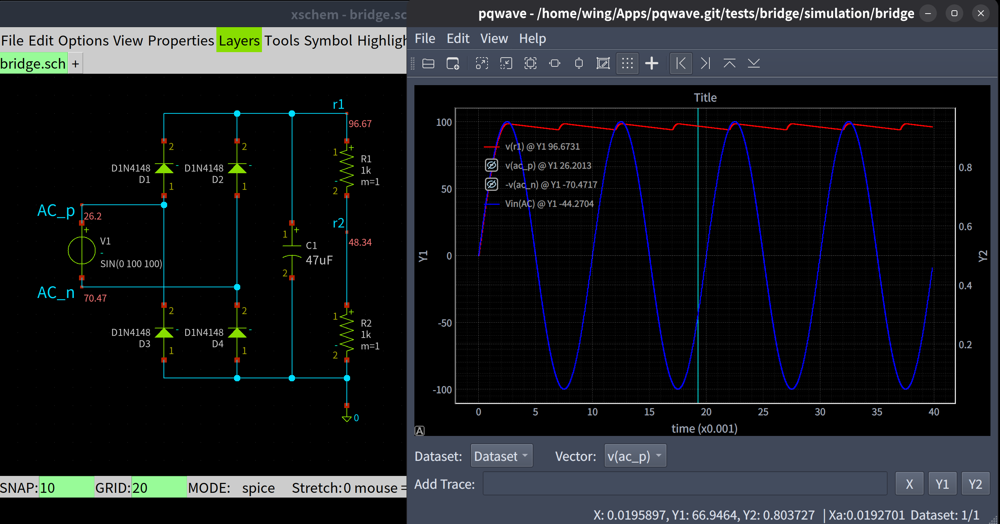

# pqwave - a Wave Viewer for SPICE raw data using spicelib and PyQtGraph


## ✨ Features

### 🎯 Core Capabilities
- **Multi-format Support**: ngspice/xyce, ltspice, qspice .qraw files
- **Dual Y-Axis**: Independent Y1 and Y2 axes with shared X-axis
- **Mathematical Expressions**: Infix notation with built-in functions

### 🖥️ User Interface
- **Unified Vector Selection**: Single combo box for all variables
- **Expression Support**: Quoted variables and complex expressions

## 📸 Screenshots


## 📦 Prerequisites
- Python 3.8 or higher
- numpy
- spicelib
- pyqtgraph
- PyQt6

## 🚀 Command Line Usage
```bash
# Open a RAW file directly
python pqwave.py simulation.raw

# Show version information
python pqwave.py --version

# Display help
python pqwave.py --help
```

### Basic Workflow
1. **Open File**: Use File → Open or command line
2. **Select Dataset**: Choose from available simulation runs
3. **Choose Variable**: Select from Vector combo box
4. **Set X-Axis**: Click X button to set X-axis variable
5. **Add Traces**: Click Y1 or Y2 to add traces
6. **Adjust View**: Use logarithmic scale or manual ranges as needed

## 🔧 Architecture
```
pqwave.py 
├── LogAxisItem    # Custom logarithmic axis display
├── RawFile        # SPICE RAW file parser, support pure SPICE, ngspice/xyce, LTspice, and QSPICE .qraw
├── ExprEvaluator  # Mathematical expression evaluator, infix notation and built-in math functions
└── WaveViewer     # Main application and UI
```
